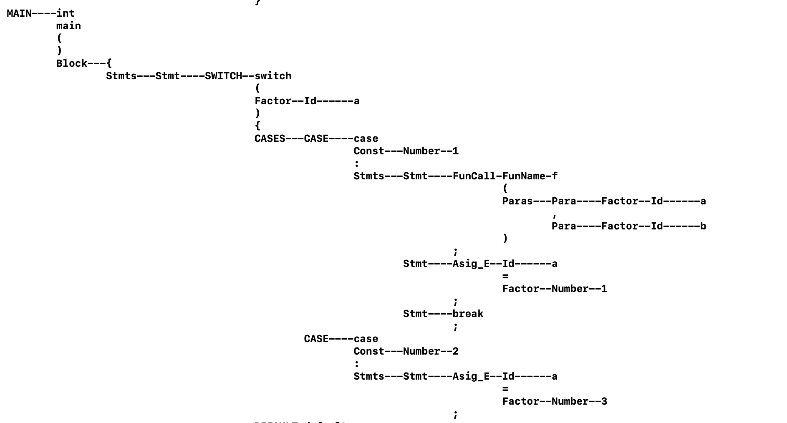
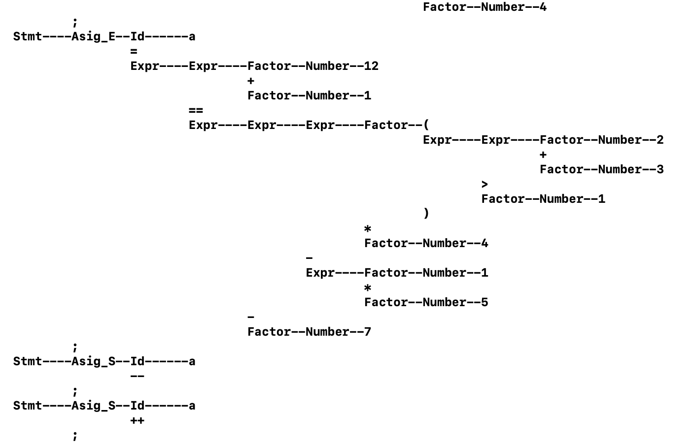

# CompilerProject2 : Grammar Analyzer

## Grammar 

PROGRAM -> HEADER MAIN

MAIN -> int main() Block

Block -> { Stmts }

Stmts -> Stmt Stmts | Empty

Stmt -> Asig_E ; | Decl ; | break ; | continue; | DO_WHILE | IF | WHILE | DO_WHILE ; |

Asig_C ; | Asig_S ; | RETURN ; | SWITCH

HEADER -> H_Stmts

H_Stmts -> H_Stmt H_Stmts | Empty

H_Stmt -> FunDef | Decl;

IF -> if ( Expr ) Block | if ( Expr ) Block ELSE | if ( Expr ) Block ELSE_IF ELSE

ELSE_IF -> else if ( Expr ) Block | else if ( Expr ) Block ELSE_IF

ELSE -> else Block

WHILE -> while ( Expr ) Block

DO_WHILE -> do Block while ( Expr ) ;

SWITCH -> switch ( Expr ) { CASES DEFAULT }

CASES -> CASE | CASE CASES

CASE -> case Const : Stmts

DEFAULT -> default : Stmts

RETURN -> return Expr

Asig_C -> Id Asig_Op Expr

Asig_S -> Id ++ | Id --

Asig_E -> Id = Expr

FunDef -> Type FunName ( ParasDef ) Block

ParasDef -> ParaDef | ParaDef , ParasDef | Empty

ParaDef -> Type Id

FunCall -> FunName ( Paras )

Paras -> Para | Para , Paras | Empty

Para -> Expr

Decl -> Type Descs

Descs -> Desc | Desc , Descs

Desc -> Id | Asig_E

Type -> bool | char | int | double | float | string

Expr -> Factor | Factor BinOp Expr

Factor -> Number | ( Expr ) | Id | FunCall

BinOp -> == | >= | > | < | <= | + ...

Number -> Decimal_Number | Octal_Number | Hexademical_Number

## AST

